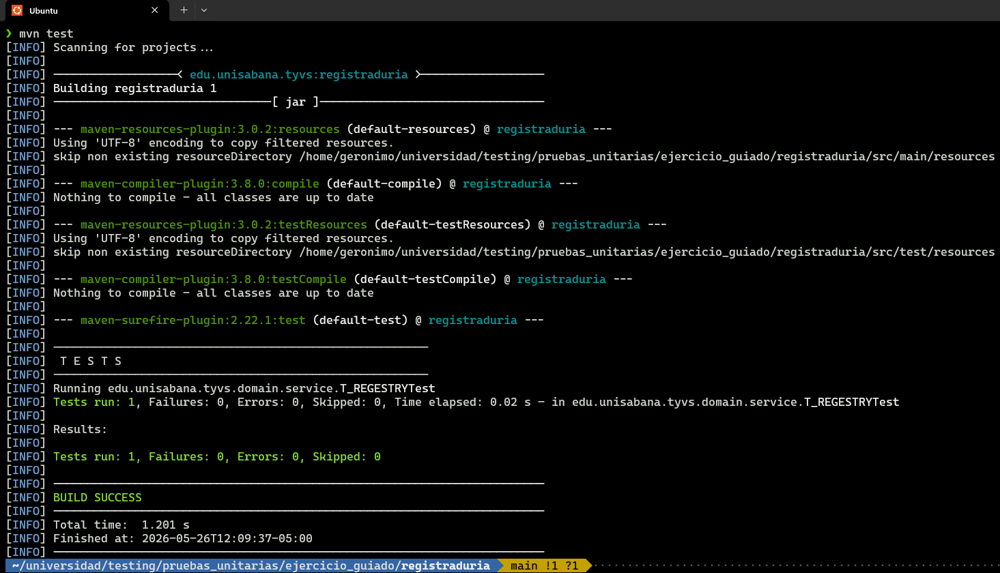
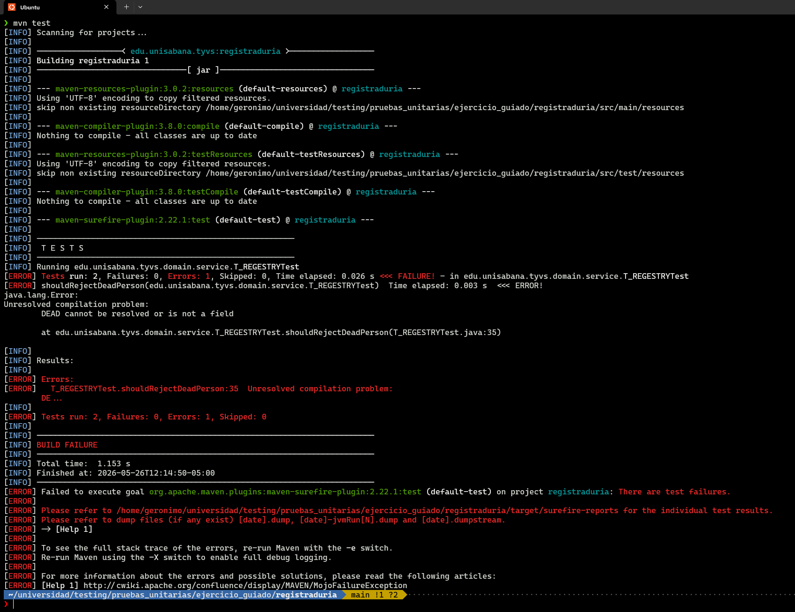
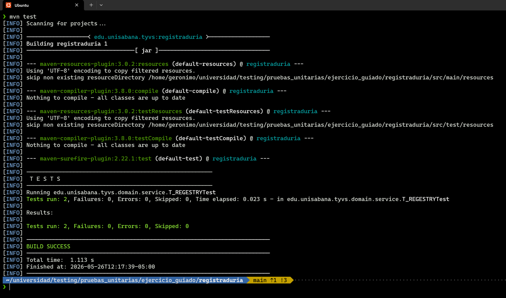

# testing
## estructura del proyecto

``` bash

```

## TDD

### GREEN

Esta es la implementacion minima para que la prueba pueda pasar sin problemas

``` java
    public void SHOULREGISTERPERSON() {

        C_REGISTRY REGISTRY = new C_REGISTRY();
        
        C_PERSON PERSON = new C_PERSON("Ana", 1, 30, E_GENDER.FEMALE, true);
        
        E_REGISTERRE RESULT = REGISTRY.C_REGISTERRESULT(PERSON);

        Assert.assertEquals(E_REGISTERRE.VALID, RESULT);
    }
```



### RED

esta es una porueba con la logica incompleta por tal motivo la prueba va a fallar

``` java
    public void shouldRejectDeadPerson() {
        // Arrange: preparar los datos y el objeto a probar
        C_REGISTRY REGISTRY = new C_REGISTRY();
        C_PERSON DEAD = new C_PERSON("Carlos", 2, 40, E_GENDER.MALE, false);

        // Act: ejecutar la acción que queremos probar
        E_REGISTERRE RESULT = REGISTRY.C_REGISTERRESULT(DEAD);

        // Assert: verificar el resultado esperado
        Assert.assertEquals(E_REGISTERRE.DEAD, RESULT);
    }
```



## green

se vuelve a hacer la implementacion minima para que la prueba pase

para esto, se realizaron 2 cambios en el codigo los cuales son los siguientes

``` java
public enum E_REGISTERRE {VALID, DUPLICATE, INVALID, DEAD}
```

``` java
    public E_REGISTERRE C_REGISTERRESULT(C_PERSON PERSON) {
        if (!PERSON.IS_ALIVE()) {return E_REGISTERRE.DEAD;}
        return E_REGISTERRE.VALID;
    }
```



## refactor

se realiza un refactor para poder completar el codigo de la manera esperada